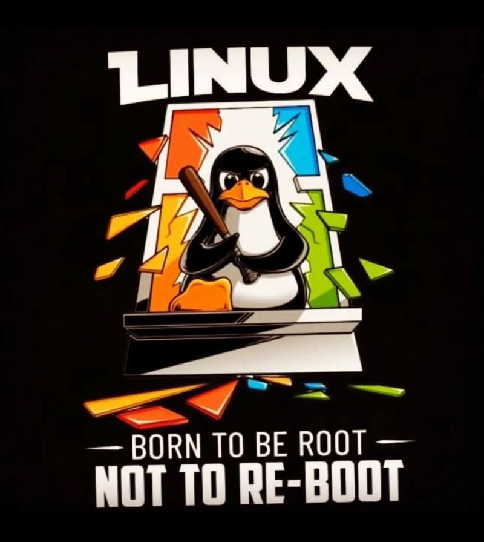
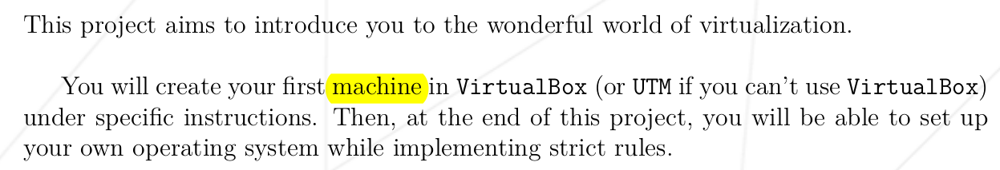
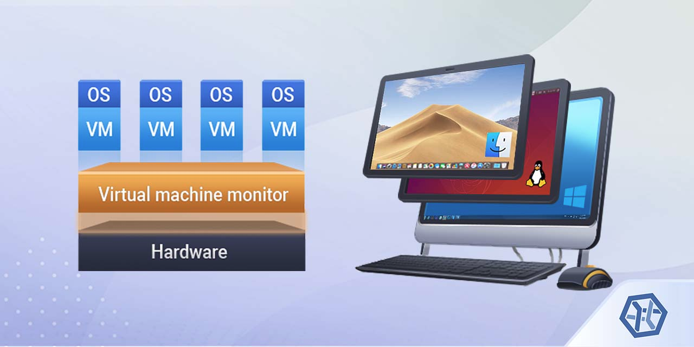
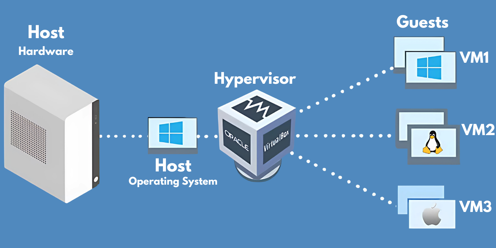
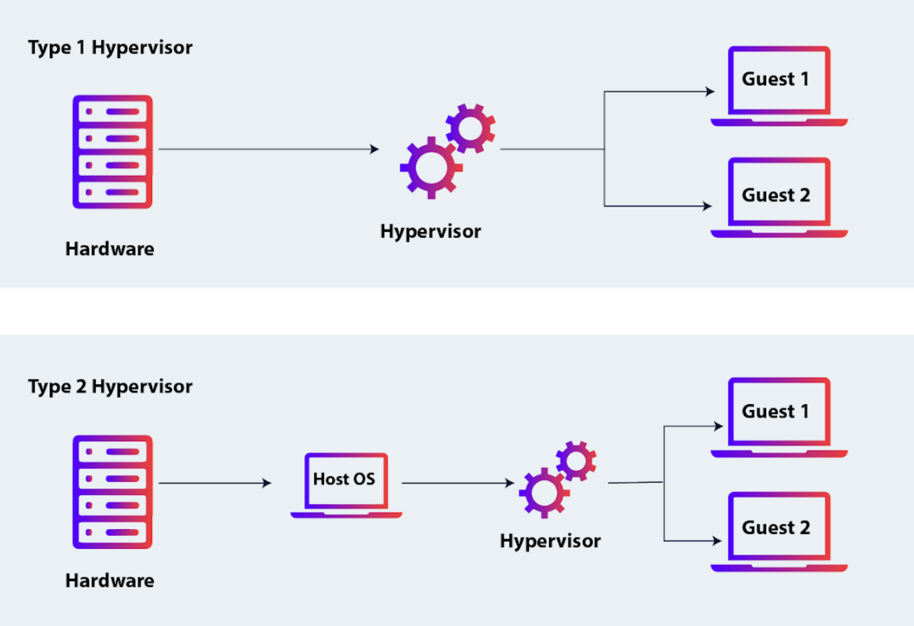
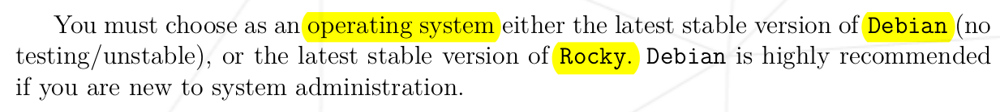

<h1 align = "center">Born2BeRoot</h1>

<p align = "center">
	
</p>


## How this article gonna help !


>**YOU ARE NOT HERE *ONLY* FOR THE CONFIGURATION OF THE VIRTUAL MACHINE, IF THAT'S WHAT YOU WANT! DON'T READ THIS MASTERPIECE WHICH FULL OF KNOWLEDGE AND INFORMATION, GO WATCH A 10 MIN YOUTUBE VIDEO hhh (shame on you buddy)** 

### You wanna pass the 42 Born2BeRoot Project. **DO YOU ??** 
<p  align = "center" >
	
</p>

So we're going into the main PDF subject, and every time we find a keyword or any scary word we don't face everyday! We gonna take our time to understand it and know how to work with it. Part per Part of the PDF until we finish the whole project ✅

# <u>Let's start !</u>




**Machine ?????**

The `Machine`here refer to **Virtual Machine** exactly. Let's understand what is it and why you should use one also !

# **Virtual Machine**

So basically you can see a VM as a computer inside your computer.

Imagine you have a computer with Windows operating system, one day you decide to start learning Linux! But you still wanna use your main computer which full of your personal data and software you use everyday .  

Of course you need to practice not just wasting your time by watching YouTube playlists or even paid courses.  

So now you should buy a new laptop so you can install the Linux operating system and start practicing your knowledge.  
**Isn't that just waste of your goddamn MONEY ??**  

VM is here to help you !

A Virtual Machine allows you to run an **entire** operating system inside your current system, isn't that great.



### **Host & Guest**  

+ The **HOST** is the operating system with the physical connection with your hardware (in our example its your Windows which contain your files, data, software, etc.)    
+ The **Guest** is the new operating system you run inside the virtual machine (In our example its the Linux so you can practice your knowledge).

The guest also use the resources of the computer (CPU, RAM, Storage, etc.), not directly of course! but with the help of the **Hypervisor**.  

# **Hypervisor**

The hypervisor is just a software installed in your host OS, its job to create computers inside your computer (VirtualBox for example).  

The hypervisor create for every new OS all the resources it needs so the new VM thinks that's it is actually a computer.

<p align = "center">
	
</p>

The Hypervisor manage and allocate the portions of all the resources needed so that every OS think its inside a real computer.

+ **Virtual CPU :** The hypervisor allocate certain number of vCPU (Virtual CPU) to the virtual machine, which are abstracted from the physical CPU.

+ **Virtual Ram :** When configuring a VM, you choose how much the hypervisor allocate of the physical memory to the guest OS from the host RAM, ensuring it wouldn't access the other host memory.

+ **Virtual storage :** Hypervisor provide the storage for the guest from the physical hard disk, it create a file on the host storage, this file act like the storage of the guest OS.  (  `.vdi` file on VirtualBox).

+ **Virtualizing other resources :** the hypervisor also provide the other virtual resources as Gpu, Network adapter, Usb devices ... 

### Types of Hypervisor :

1. **Type 1 :** ( Bare Metal Hypervisor) This type don't need an interaction with a host operating system, requires setup knowledge. It take all the resources it needs directly from the physical hardware, it is used mostly by the companies, servers, cloud computing ...  And not for personal uses or testing a new OS.

2. **Type 2 :** ( Hosted Hypervisor ) This type of hypervisor is the one we gonna use on our project, it is easy to set up, great for personal uses and testing. It runs on top of a host OS as an application.

<p align = "center">
	
</p>

# **Operating System, Linux, Debian and Rocky**



### > Operating System

The operating system is a software developed using programming languages like C, C++ or Assembly. It act like intermediary between the user and the computer's hardware, manage the hardware resources as CPU, RAM, Storage, Peripheral ( keyboards, mouses, usb's etc. ),  run applications and provide user interface for the interaction.

The operating system interact directly with the hardware with the help of its kernel and device drivers.

**Kernel :** The core part of the operating system that interact directly with the hardware, acts as a bridge between the hardware and the rest of the operating system, enabling communication between the software and the hardware.  

**How to communicate with the kernel ?**  
**System calls :** Are the primary interface between the user programs and the kernel, allow user applications to request services from the operating system such file access, process control or communication ... 

<p align = "center">
	
</p>


### > Linux is not what you think it is !!!!!

You think that Linux is an entire operating system where you run commands like `ls`, `cp`, `cat`, etc. Including shell command-lines and libraries such glibc for running programs.
But you're completely **wrong** my friend! Because you are talking about the GNU not the Linux.

Linux is the kernel, the core of the operating system, the entire OS is named **GNU/Linux** which combine the Linux kernel and the GNU Project tools and utilities.

<p align = "center">
	
</p>


Before diving into Debian, Rocky and the difference between them. We need to understand those two concepts :

1. **Linux distribution :**
 
Linux distribution is a complete operating system built around Linux kernel with additional software like system libraries, utilities and package management tools, created from groups and individual developers for specific purposes.  

2. **Package manager :** 

Command-line or graphical tool to automate the process of installing, updating and removing software packages on Linux system, don't be scared by the word **package** you can see it as a normal software you wanna install, to install our package we need a package manager.

>On the next chapter we gonna give more time to **APT** and explain the package manager and how it works .


### > Debian and Rocky

+ **Debian** is a Linux distribution composed of **free** and open-source packages, comes with clean user interface not like the Windows OS fooled of news and ads, Debian update are well tested before releasing. The Debian distributions focus more on the stability, security and privacy of the user, also comes with the powerful package manager APT which help a lot for installing, upgrading or removing software on the system.

+ **Rocky** is based on Red Hat Enterprise Linux (RHEL), which is a Linux distribution for the commercial market developed by the Red Hat, Rocky focus on enterprise-grade software. Good for servers, enterprise environment, cloud computing ... Not for a beginner with the Linux operating system.

#### Why Debian ?

I think we already answer that from explaining each one of  them, Rocky is for the enterprises and companies not for someone new to learn system administration and basic Linux concepts, also Debian has more packages.


# APT, Aptitude and AppArmor


### > Package Manager

We talk earlier about the package manager, now its the time to go deeper.

As we say that the package manager can be a command-line or a graphical tool help us to install, upgrade and remove packages which are software .

`dpkg` is one of the package managers, but i don't recommend it for you, because you're going to face a lot of problems, first you need to find and download the `.deb` file of the package you wanna install, but the big problem is when you face the  **dependency** problem. 

**What is dependency ???**

When installing a package it depends to other packages to work, using **dpkg** you need to install them manually if they not exist on your system. Instead! there is other package managers that install the dependencies automatically like **APT** the powerful package manager.


### > APT

**APT** stand for Advanced Package Tool, released on 2014, a powerful package manager used by Debian-based Linux Distributions ( Ubuntu, Linux Mint, etc.). It simplifies the process to manage packages by automating tasks as resolving the dependencies and downloading packages from repositories.  

Unlike `dpkg` you don't need to install the `.deb` file, just use the apt command plus the name of the service you wanna install. **THAT'S IT !**  
Example : `apt install firefox`

The APT automatically install and update all the dependencies needed to install a package.

**Apt and Apt-Get :** The both apt and apt-get access the same back-end resources, we're talking about the same repositories for downloading and managing software packages.
Apt is newer than Apt-Get, also the Apt is user-friendly interface and provide cleaner output and progress bars for a better user experience.

<p align = "center">
	
</p>

**How APT works ?**

APT relied on a list of repositories which are storage location or someone's server with collection of software, we can check those repositories using the command `/etc/apt/sources.list` and for additional files in `/etc/apt/sources.list.d/`.

When requesting a package \` `apt install firefox` \`  the Apt checks which dependencies are needed to install the package and ensuring installing them if they not exist, then tha Apt download the `.deb` package file from the repository specified in `source.list`.


**Update Package Metadata**

When you run : `sudo apt update` the Apt downloads the latest updates of the packages from the repositories as versions, dependencies and descriptions and store this data locally on `/var/lib/apt/lists/` for faster lookup.  


### > Aptitude

The aptitude is a package manager older than the APT, it was released on 1999. It offers additionally of the command-line interface a **full-screen text-based graphical interface**,  making it more user friendly, also it shares the same back-end resources as APT.

(Snapshot of the Aptitude graphical Interface)


**So why APT created?**

`apt` and `aptitude` are **complementary**, not competitors. The APT was not created to kill the Aptitude or something like that, the APT focus on modernization, before APT the package management required using multiple tools like `apt-get` , `apt-cache` , `dpkg` , etc. The APT merge all those functionalities into a single. 

For example :  
+ Old way : `apt-get install`, `apt-cache search`.
+ New way : `apt install`, `apt search`.  


### > AppArmor

AppArmor is a Linux Kernel security module restrict the resources that the program or application can access, enhancing the system's overall security.

 **-** Check if active : `systemctl status apparmor`

**Example :**  Web-Browser don't need to access system files like `/etc/passwd` or your private data as photos. AppArmor restrict the browser to access those directories and files, so even if the program is hacked, the hacker will not have the access to sensitive data.

The AppArmor uses set of rules called **profiles**, which is a configuration file that contain :
+ what files a program can access to ;
+ what system resources can be used (Webcam as example, etc.) ;
+ what types of actions a program can take (connect to internet but not run other programs) .

AppArmor links a profile to a program by matching the profile's **name** to the application **executable path**. 
+ Path of Firefox ---> `/urs/bin/firefox`
+ Firefox Profile name ---> `/etc/apparmor.d/usr.bin.firefox`

**Example of a Profile file:**


AppArmor can use two modes to handle profiles :
+ **Enforce mode** : The profile is active and the AppArmor block actions not allowed by the profile. To set ---> `sudo aa-enforce /etc/apparmor.d/usr.bin.firefox`
+ **Complain mode** : The profile is active but the AppArmor just logs violations without blocking them, this mode is good while testing a profile. The logs are on the default Linux logs path `/var/log/syslog` . To set ---> `sudo aa-complain /etc/apparmor.d/usr.bin.firefox`

**Loading a Profile :** When creating or updating a profile we need to load this file to AppArmor so when enforcing it the system knows what to enforce.  
The command is  ---> `sudo apparmor_parser -r /etc/apparmor.d/usr.bin.firefox` 


# Filesystem, Booting, Partitioning and Mounting 


## > Linux File System

> **NOTE THAT EVERYTHING IN LINUX IS A *FILE* !!!**


The Linux file system is a structured way to organize and manage data on device in Linux OS. Let's give some time to the important directories on the root directory tree.

+  `/` : Root directory the top-level directory on Linux, if something happened to root directory that can cause to the entire system fail .
+ `/home` : Store personal data and configurations for each user .
+ `/boot` : Contain files needed for the system to boot .
+ `/bin` (essential binaries) : Contain the basic commands as `ls`, `cat`,`cp` in machine code .
+ `/sbin` : System binaries, includes the super-user commands used for system administration  like `adduser`, `userdel` ...
+ `/lib` : Houses essential shared libraries required by the `bin` and `sbin` binaries .
+ `/etc` : Human editable files for the system-wide configuration like `network`, `bluetooth`, `passwd` for the users account information ...
+ `/tmp` : Temporary storage for files used by programs during runtime, all those files are clearer after reboot.
## > Booting

Computers use **firmware** to initialize hardware, firmware is a small program stored inside a ship on the motherboard. When we start the computer it's the first program the computer runs, it preforms three tasks :  
+ **Initialize all hardware devices :** It checks if all hardware are functional, this process know as **POST** (**P**ower **O**n **S**elf **T**est), if everything is alright it pass to the next step. If not it stops the startup o the machine.
  
+ **Find the Bootloader program :**  We can store the bootloader in any external storage device as a Hard Disk, USB, CD, DVD, etc. Firmware looks for the bootloader in sequence until it find it, starting from the Hard disk, if the bootloader is found then the firmware stop looking and start executing the bootloader, if not it checks the USB then the CD. If the bootloader is not found then firmware stops the startup.  
	There is two types of **firmware :**    
	+ **BIOS :**  BIOS Looks for the bootloader just in the first 512 bytes of every storage device until it find it. This first small section is the **MBR** which store the bootloader and partition information. Support maximum partition size of 2TB, and support up to 14 partitions, 3 primary and 1 extended (11 logical max inside the extended). 
	  
	+ **UEFI :** It find the bootloader after the first sector, it reads 4Kb after skipping the first 512 bytes of MBR, this sector of 4Kb named **GPT**, which also store the bootloader and partition information. Support up to 128 partitions and a maximum of partition size up to  18 EB (Exabyte) .

+ **Execute the Bootloader .**

<p align="center">

</p>


## > Partitions

The partitions on the Host are a division of the device storage (HDD, SSD) into separate, isolated sections.

For Guest the entire virtual partitions located inside the file allocated by the hypervisor as the virtual hard disk,  Each section act as a separate **container** for a specific purpose (OS files, user data, swap space, etc.).

**Types of Partitions :**

+ **Primary Partitions :** Is a directly accessible section of the disk that can store data or an operating system, every VM at least use one primary partition for the **root** filesystem .
+ **Extended Partitions :** Are container partition that holds additional partitions called logical partitions .
+ **Logical Partitions :** Exist inside an extended partition and behave like primary partitions, they are  numbered starting from `5` (`/dev/sda5` , `/dev/sda6` ...). Logical partitions are ideal for organizing data (separating `/home` and `/var`)
<p align = "center">
	
</p>

## > Mounting

Mounting refers to the process of making a `storage device` or a `filesystem` accessible and attached at a certain point in the directory tree called a mount point.

If you have a USB drive at `dev/sdc1` and you want to mount it to the `/media/usb` directory you have yo use the command `mount /dev/sdc1 /media/usb` 

For example you plug-in the USB and you don't mount it to a filesystem you won't be able to access to the files on the USB, because Linux needs the filesystem to be integrated into the directory tree.

# LVM 

 [The Best YouTube Video To Understand The Configuration of a LVM Using Terminal](https://www.youtube.com/watch?v=214rUhQe7B4&t=98s&ab_channel=DorianDotSlash)

LVM is short of Logical Volume Manager, allow the creation of **Groups** of disks or partitions that can be assembled into a single (or multiple) filesystem.  
Can be used nearly for every mount point **EXCEPT** `/boot`, because GRUB cannot read from LVM metadata.

Why LVM and not standard partitions ?  
With LVM you can resize the volumes however you want, you can shrink the volume for the unused space, also growing the volume if you face the `space remaining` Linux message or just if you need to.  

>DON'T LET THIS PICTURE SCARE YOU BUDDY! BY THE END OF THIS CHAPTER YOU GONNA UNDERSTAND EVERYTHING I PROMISE.

<p align = "center">
	
</p>
So this picture provide us how the LVM is structured on the Linux system :

- **Hard Drives :** Are the physical disks installed on the system (HDD, SSD, also USB it can plays as a hard drive). They are represented from `/dev/sda` for the first hard drive, `/dev/sdb` for the second and so on.

- **Partitions :** We may only need a single part of the drive for the LVM, so we divide the drive into two partitions (`/dev/sda1` for LVM, and `/dev/sda2` for `/boot` for the system bootloader or the `/swap` partition)

>**THE LVM STRUCTURE START FROM HERE**
  
- **Physical Volumes :** Is a partition (or an entire disk) crated using `pvcreate` command prepared to be used by LVM, After using the command `pvcreate` the partition recognized as a Physical Volume, and we cannot name the PV for example now the `/dev/sda1` is a Physical Volume we cannot rename it to `pv1`, also we can't combine two partitions into one single PV even if they are on the same disk. Each PV must map to a single partition.
  
- **Volume Group :** The one responsible to combine multiple Physical Volumes into a single logical storage pool using the `vgcreate` command, the size of the VG is the sum of the PV, we can name the VG as we want, `vgcreate datavg /dev/sda1 /dev/sdb1 ...` we create a VG named `datavg` combine all the Physical Volumes in one space. 
  
- **Logical Volumes :** You can see it as the Partition on the standard way, they are created by allocating space from the VG using the command `lvcreate -L <size> -n <LV name> <VG name>` the `n` flag for naming the Logical Volume. To extend an existing LV if more space needed use the command`lvextend -L <+NewSize> <LV_Path>`.  
  **Examples :**
	+ To create : `lvcreate -L 20G data datavg`
		+ Resault ---> New LV named `data` created on `/dev/datavg/data` with the size of 20GB
	+ To extend : `lvextend -L +5G /dev/datavg/data`
		+ Resault ---> The `data` LV resized to 25GB  
	
	The `-l` flag for getting the free space from the VG by percentage, `lvextend -l 50% /dev/datavg/data` extend for us the data LV by adding 50% of the VG free space .

+ **File Systems :** used to organize, store and manage files and directories on the Logical Volume making it accessible by the operating system.  
  Before attaching Logical Volume to a specific path, we need first to pass by a necessary step which is formatting the Logical Volume, creating a Logical Volume doesn't automatically prepare it to store files, it must be formatted to a filesystem structure like **ext4** which stand for the fourth extended filesystem. 

#  Configuration of the VM

Now you are **eligible** to start creating your own Virtual Machine. You got about 50% of the definitions to start your administration journey (on Born2BeRoot project of course hh), the other terms we gonna explain them Later.

After configuring your Virtual Machine with the help of this [video](https://www.youtube.com/watch?v=jxReupv7UOo&ab_channel=Iv%C3%A1nAgudoD%C3%ADaz), **GET BACK HERE TO START OUR REAL JOURNEY 🤍**

After finishing the configuration step, the first thing you should do is to make sure that your `lsblk` command result is the same as the one provided on the project PDF, everything should be like this :

`lsblk` : 


 
## > ROOT User
<p align = "center">
	
</p>

The root is the **superuser** of the Linux system, the default administrative account with unrestricted access to the entire system and all of its resources, he is the most **powerful** user on Linux.  
**The root** user has the power to :  
+ Modify system files;
+ Create and manage users;
+ Manage devices like disks, network interfaces and peripherals;
+ Modify the files and directories ownership and access rights.
+ and more ...

## > SUDO 

The ROOT is great! But with that huge power you can damage your entire system if you misused it.  
The **SUDO** (Superuser DO) user on Linux as a mini-root who has the ability to execute commands with high privilege, like you're executing the command with the root user, but not all the privilege of the root, those files that the SUDO can access are limited by the root, the root user choose which files and command the SUDO could execute.  

### Install SUDO utility

First change the user to the root using the `su -` command and using the apt package manager make the command `apt install sudo` to install the SUDO, then reboot the system to be activated using the command `sudo reboot`  
<p align = "center">
	
</p>  

## Creating of users and groups


We need to know how to create a new user, new group and how to link them.  
 
For me I already add a new user when configuring the Virtual Machine, to test the commands we gonna create a new user, rename his username and then delete him .

\- Create a new user with the username **rbassamy** :
<p align = "center">
	
</p>  

\- Rename the username **rbassamy** into **NewName** and then **delete** the user from the system :
<p align = "center">
	
</p>

Note that :  
\- When creating a new user also a group is created with the same username.  
\- All the users are stored on the file `/etc/passwd` , users passwords are stored on the file `/etc/shadow` as hashed format.  
\- `usermod` command stand for user modification

Now we gonna create a group, add a user to it, display the groups of a user and how to  remove a user from a group :
<p align = "center">
	
</p>  

# > SSH


It's the time to configure the SSH service on our system. BUT **what is SSH? PORT??**  

### Network Port

**Port** is a logical connection (*not physical*) used by programs and services to exchange information. The port have a unique number that identifies the service, for example here hare some of the common port numbers :  
+ Port 80, 443 : Web pages (HTTP, HTTPS);
+ Port 21 : FTP (File Transfer Protocol);
+ Port 22 : SSH.  
Port is always associated with an IP address (Identifier of a device on the network), the IP address determine the geography location of the server, and the port determine which service to use on that server.

### SSH

**SSH** stand for **S**ecure **SH**ell, SSH is a network protocol designed to secure the connection between two systems (client and server) by encrypting the communication, provide secure way to execute commands, transfer file or manage server.

Before diving into the SSH commands, let's first understand how SSH works behind the scenes (Don't worry, we won't go too deep. RELAX, BUDDY! hh)  :  

+ **1- Client initiates the connection :** The client first sends an initial handshake packet to the server indicating it want to start a new SSH session, that happened on the **Transport Layer** of the network (TCP protocol);

+ **2- Server response :** The SSH Daemon (sshd) on the server listen for incoming connections on ssh port, after receiving the client packet the server send its identity via public key plus the supported encryption algorithms as part of the handshake;

+ **3- Key exchange & Encryption setup :** The both server and client negotiate for a session key using key exchange algorithm, the client validate the server's public key to be sure of the right server, the client generate a session key and encrypt it using the public key of the server, the server now decrypt the session key using its private key , now both parties shared the same key session.   

+ **4- Client Authentication :** 
	+ **Password Authentication :** the client user provide a password and the server verifies the password against its local database;
	+ **Public Key Authentication :** The client sends digital signature created with its private key and the server validate the signature using the client's public key.

After a successful authentication, the SSH session is established and the communication is encrypted using the session key.  

##### **Let's start now the SSH configuration**  

- We need first to update the package manager for the latest services updates : `apt update`  
- Then to install the main tool for remote access with the SSH protocol using OpenSSH : `apt install openssh-server`  

- Let's check the ssh status using the command : `service ssh status` 


As you can see that the SSH is **ACTIVE** but on the port 22! The subject ask us to use the port 4242 as the **SSH PORT**. So we're going to change it using those two files :

+ `/etc/ssh/sshd_config` : you'll find a line with a comment `#Port 22` change it to `Port 4242`
  <p align="center">
	  
	</p>
			Also on the same file we will block the root from using ssh for remote connection using the line `#PermitRootLogin prohibit_password` into `PermitRootLogin no`
		  <p align="center">
	  
	</p>
	
+ `/etc/ssh/ssh_config` : Also find the port line and change it to `Port 4242`
    <p align="center">
	  
	</p>
		
To activate those changes we're going to restart the ssh service using the command `service ssh restart` 


### Connect remotely using SSH

By default the guest OS is totally isolated from the host OS, to connect remotely the guest OS we need a bridge that forward the traffic between the host and the guest OS. **Port Forwarding** do the exact thing by mapping a port on the host to a port on the guest.  
**This is what happen :**  
+ Host receive SSH traffic on the 4242 port;
+ VirtualBox forward the traffic to the guest OS  4242 port.
Let's configure **port forwarding** on VirtualBox : 

<p align= "center">
	
</p>

**Then create a new rule :**
<p align= "center">
	
</p>

Why 127.0.0.2 and not **localhost** (127.0.0.1) ?
If you wanna use the localhost IP, you need to stop the service already running on the port 4242 on localhost, its been created by the staff. So we **should't miss** with it. Because of that we need to use another IP address for the host to connect remotely to our server using SSH service.

### Connection commands

We set everything we need to remotely use our server from the guest on the host OS.  

To start a new session on host : `ssh <username>@<IpAddress> -p <port>`;
	In my case : `ssh mzanana@127.0.0.2 -p 4242` 
		
To finish the session : `exit`.

#### **The next part is optional because am crazy 🤪**

What if we want to remotely connect our server using the **public key** instead of putting the password every time ?

We need first to generate the public key on our host machine using the command : `ssh-keygen`.

In your **Guest** OS if  `~/.ssh` is not found then you need first to create the SSH directory :  
`cd ~` ---> `mkdir .ssh && chmod 700 .ssh .

Now we need to add the host public key to the guest system so it can be recognized when connecting.  
For that we need to create a new file named `authorized-keys` on the SSH guest directory.  
Copy the key to the authorized file using the command : `ssh-copy-id -i ~/.ssh/id_rsa_pub -p 4242 mzanana@127.0.0.2 


No password authentication for the `mzanana` user :
<p align = "center">
	
</p>

# Firewall

Firewall is a security system control the incoming and outgoing network traffic, which is the data packets sent between devices over a network. Including various types of communications, such as web browsing, file transfers, SSH connection, etc. These packets are directed to a specific **ports** on your machine.  
The firewall allow or block traffics based on ports, IP addresses or also the protocols. 

# > UFW

**UFW** stand for Uncomplicated Firewall. 
UFW is a simplified front-end for managing firewall rules in Linux systems. By default, it denies  all the incoming connections unless the allowed ports.

**Commands time :**  

-> Check if **UFW** exist on the system : `ufw status`  
<p align="center">
	
</p>

-> Enable the UFW service : `ufw enable`  
<p align="center">
	
</p>

#### IF You planned to Do the BONUS jump the next part !

If you gonna do just the Mandatory part you need to kill the process running on port 68 as asked on the subject 
<p align="center">
	
</p>

`-tunlp` flags explanation :
+ `t` : Display TCP sockets;  
+ `u` : Display UDP sockets;
+ `n` : Display results in numeric format;
+ `l` : Display listening connections;
+ `p` : Display process ID;

On page 9 of the Project PDF they don't have the udp process, so we need to kill that process from the system .  
The process start automatically when the system boots up, so the idea is to kill the process using a **startup script** named `/etc/rc.local` that execute automatically commands or scripts when the system boots-up.

**Set up `rc-local` service:**

Using the `systemctl status rc-local` we notice that the service is dead :
<p align="center">
	
</p>

We need now to start the service and check again
<p align="center">
	
</p>

As you see that there is a `condition failed` error because of the script `/etc/rc.local`is not found, so we need to create script named `/etc/rc.local` and include the script we want to execute when booting the machine, which is the `pkill -f dhclient` command that kill a process `dhclient` running on the system. After that give the file all the permissions, then restart the service using `systemctl restart rc-local` command 
<p align="center">
	
</p>

<p align="center">
	
</p>

Now let's check again the `ss -tunlp` : 
<p align="center">
	
</p>

**THE PROCESS IS KILLED SUCCESSFULLY!**

->The best thing you can do now remove the ufw and reinstall it again, if the port 68 still exist just delete it using the `ufw delete X` command (`X` is the line number of the port 68.  


Let's remove completely the **ufw** service :
<p align="center">
	
</p>

Delete the folder of the ufw that still exist on `/etc/ufw` and install ufw again :
<p align="center">
	
</p>

Enable the **ufw** service and allow only the port 4242 :
<p align="center">
	
</p>

Allow outgoing traffic and deny any incoming traffic  
<p align="center">
	
</p>

# > Password policy

**Let's begin the configuration by those three requirements :**

 

For that we need to edit the `login.def` file, find the `Password aging controls` on the file and edit the values as requested :


To make sure that everything worked fine, use the `chage -l <username>` command.


**WHAT'S GOING ON ?? WHY OUR CHANGES ARE NOT APPLIED ???**   
Relax buddy! Everything works perfectly as we want! Our changes are applied only for the new users, not to those who already exist on our system.

We need to configure the passwords of the `root` and `mzanana` users manually, by the help of `chage`  command again.


**Let's jump to the next step :**


For those advanced configurations and without using a package, we may need to make a script and call it every time and that take us lot of time. Instead we gonna use a package to make our life easy.

The package called `pam_pwquality` and we gonna install it using the command :

<p align = "center">
	
</p>

The package now is installed! To use it we gonna edit the file `/etc/pam.d/common-password` :


this is the part missing on the first line after the `maxrepeat` option :


the entire configuration :  
```
password      requisite      pam_pwquality.so minlen=10 ucredit=-1 lcredit=-1 dcredit=-1 maxrepeat=3 reject_username enforce_for_root
password      requisite      pam_pwquality.so difok=7
```

The explanation of each option :

⚪ `minlen = 10`           : Password should be at least 10 characters;  
🔴 `ucredit = -1`         : `-1` refer to the need of minimum one uppercase character on the password, if the number is `+ 4` means that the maximum of uppercase characters is 4 characters;  
🔵 `lcredit = -1`         : At least one lowercase character;  
🟢 `dcredit = -1`         : At least one digit from `0123456789` on the password;  
🟡 `maxrepeat = 3`       : Can't type the same character four times following each other. `mzaaaanana` is not valid!  
🟣 `reject_username`   : The username shouldn't exist on the password;  
⚫ `enforce_for_root` : Those policies are applied also for the `root` user;  
🟠 `difok = 7`              : The `difok` option stand for `DIFference OK`, the system make a character by character comparison between the old and new passwords, starting with `difok = 0`. Each time characters in the same position are differ, `difok` value incremented by `1`. Once the comparison reaches the end of either password, if `difok >= 7` then the new password is valid, otherwise an error message is displayed.   


**Those policies are applied for the new users, to change the current password of the `root` and `mzanana` users just use the `passwd` command**
<p align="center">
	
</p>

# Sudo group Configuration

<p align = "center">
	
</p>

We're going to edit the sudoers file to configure the sudo group.

BUT WHAT IS A **SUDOER FILE ?**   
`sudoers file` is a file that define which users and groups have permission to execute with the sudo command, also contain the configurations of the sudo group, the file located on `/etc/sudoers` and the safest way to edit this file is `visudo` command, for syntax validation to not messed up the system by error.

Let's edit the sudoers file using the command `visudo` to configure our **sudo group** :

<p align="center">
	
</p>

🔴 Total tries for the user to enter the right password ;  
🟠 The custom message appear when the password is incorrect ;  
🟡 Active the logs for the input commands from the user ;  
🟢 Active the logs for the output result displayed on terminal ;  
🔵 The PATH where the logs gonna stored ;  
🟣 Require the TTY mode for all the sudo commands .

**What is TTY ?**  
TTY is a mode stand for Teletypewriter, in Linux every terminal session is associated with a TTY, when **TTY mode** is enables for `sudo`, it ensures that `sudo` command are only executed from a terminal session not a **scripts** or **malicious programs**, making sure the command is used only in interactive terminal session where the user is **present**.

**How can i see the Logs ?**  
Simply by using the command `sudoreplay /var/log/sudo/00/00/0x`, and the x is the number of the `sudo` command executed.


# Script


What is a **script** ?  
Script is a file containing a sequence of commands or instructions written in a scripting language (bash in our case). The script help to automate tasks, configure systems or interact with applications and OS.

### 1. Architecture

OS architecture refers to the structure of the computer's processor and the operating system that runs on it, of course details about the kernel. 

-> Command to prints system information : `uname -a`  
 


### 2. Physical Processor

**CPU, core and thread ?**
+ **CPU :** The brain of the computer, CPU which execute programs and handles data by performing operations as addition, comparison, etc;
+ **Core :** Single independent processing unit withing the CPU, each core execute its own instructions independently. Processors today often multiple cores to handle multiple tasks at the same time;
+ **Thread :** Is a virtual execution unit within a core, each thread can handle a separate stream of instructions, and a core can handle multiple threads at the same time.

<p align="center">
	
</p>

**Physical  Processor** refers to the actual physical CPU installed on the host machine, the physical processor contain the cores and threads. All the information about the CPU exist on the file `/proc/cpuinfo`   

-> Command for the number of physical processors : `grep "physical id" /proc/cpuinfo | uniq | wc -l`   
<p align="center">
	
</p>

### 3. Virtual Processor

Virtual Processor is a logical representation of a CPU core that is presented to a virtual machine by the hypervisor. The hypervisor create vCPUs for the VMs and translate their instructions into operations on the host CPU.  
When you configure 10 vCPUs in a VM, the hypervisor assign 10 **threads** from the physical hardware to the VM. So each vCPU corresponds to a **thread** on the host's physical CPU.
<p align="center">
	
</p>

### 4. Memory Usage (RAM)

Let's give a look to the **awk** :  
**awk** is a powerful text-processing tool operate line by line that allow you to manipulate and analyse text data in a flexible way.  
Basic Syntax : `awk 'pattern { action }' file`  
+ `Pattern` is a condition that determines whether to process the current line;
+ If no pattern is provided, the action applied on all lines;
+ `Action` is a set of instructions to execute when the pattern matches;
+ If no action is provided, matching lines are printed.

**awk** fields and records :  
+ `Record` in awk is a line of text;
+ `Field` is a column within a record delimited by space or tab;
+ `$1`, `$2`, ..., `$NF` represent the first, second, ..., and last field in a line;
+ `$0` represents the entire line.

Command for The current **available RAM :** `free --mega | awk ' /^Mem:/ {print $3} '`  
<p align="center">
	
</p>

Command for the **RAM utilization rate** as percentage :   So we gonna use the available RAM divided by the total memory  
`free --mega | awk ' /^Mem:/ {printf("%.2f\n", ($3/$2)*100)}'`
<p align="center">
	
</p>

### 5. Disk Usage

`df` command, also known as the disk free. Contain information about the file system disk space usage on the mounted file system.
<p align="center">
	
</p>
Command for available memory on your server :   
We want the data on MB, so we'll use the `-m` flag, for the entire server using the `--total` flag.  
`df -m --total | awk '$1 == "total" {print $3} '`
<p align="center">
	
</p>
For the disk utilization rate we divide the available disk to the total disk storage, using the command : `df -m --total | awk '$1 == "total" {printf("%d/%dGb (%.2f%%)\n", $4, $2, $4/$2*100)}'`
<p align="center">
	
</p>

### 6. CPU load

The command we will use is `top`, which is used to display Linux processes. It provides a dynamic, real-time view of the running system.  
`top -bn1 | grep Cpu`:

- The `-n1` flag stops the command after one iteration.
- The `-b` flag runs `top` in batch mode, producing plain-text output.

Let’s see the usage of `-b` flag :


The full **CPU Load** Command :

`gsub` function used on the next command 


The final command: `top -bn1 | grep Cpu | awk '{gsub(",", " "); print 100-$8}'`

Why `100-$8`?  
The `$8` field represents the idle CPU time, which is the percentage of time the CPU spends doing nothing (unused percentage). By subtracting `$8` from 100, we calculate the percentage of CPU being actively used on the server.

### 7. Last boot

To get the date and time of the last reboot we gonna use the `who` command .
<p align="center">
	
</p>

The final command : `who -b | awk '{print $3 " " $4}'`
<p align="center">
	
</p>

### 8. LVM use


+ `grep -q` run the command in silence without displaying the regular output;
+ `&& --A-- || --B--` This command check if the command `grep -g lvm` return  `1` then it applies the `A` part, otherwise it applies the `B` part.  
So the final command is : `lsblk | grep -q && echo "yes" || echo "no"`  

### 9. Connections TCP

To check the active connection, we mean we gonna find out how much Established connection used by TCP.  
`ss` command stand for `socket statistics` used to display the network statistics .
The final command : `ss -ta | grep ESTAB | wc -l`
+ `t` : Display the TCP connections;
+ `a` Display all the connection state whatever if LISTEN, ESTAB, UNCONN, etc.


### 10. Users number

We have to get the number of the users currently using the server.

Before remotely connecting `mzanana` user using ssh :
<p align="center">
	
</p>  

After connecting `mzanana` 
<p align="center">
	
</p>  

The final command is : `users | wc -w`

### 11. Network

Let's get the IP and the MAC of the server.  
IP command : `hostname -I`   
MAC command : `ip link | grep ether | awk '{print $2}'`  
<p align="center">
	
</p>

### 12. Sudo


The command : `journalctl _COMM=sudo | grep COMMAND | wc -l`  
+ `journalctl` includes **all attempts** to use `sudo` (whether successful or not).
+ `grep COMMAND` ensure to count just the executed `sudo` commands, not failed attempts. 

# The final script / Cron


## wall

**wall** command in Linux  system used to display a message to all the users of the server.  
To remove the header : `wall -n "Please update the service X!"`  

## Final script

We're gonna create the script `monitoring.sh` on `/root`  (choose any directory you want)


AM GONNA EXPLAIN THE `if` STATEMENT SOONER !

In our case we gonna use the **wall** command inside a script which gonna applied by the cron. **But what is CRON ?**  
## Cron 

If you want a job or work to be scheduled on your **Linux OS**, the **crontab** command will be a popular one.  
+ **cron** is the name of the tool;
+ **crontab** is the file name where the instructions and jobs exist to be schedule and executed by cron.


`crontab -e` to edit the crontab  file 

At the bottom of the file you gonna find the next highlighted line


`m` : Specifies the minute when the command will run, ranges 0 => 59;  
`h` : Which hour of the day the command gonna schedule to execute, ranges 0 => 23;  
`dom` : Day Of Month, range 1 => 31  
`mon` : Month, range 1 => 12  
`dow` : Day Of Week range 0 => 7 (0 and 7 represent sunday)  

You can visualize the process using the link of this tool [crontab.guru](https://crontab.guru/)  
Example from the [Website](https://crontab.guru/)
<p align = "center"></p>

# ARE YOU DUMB !!

<p align="center">
	
</p>

Please if you can understand English a little bit you gonna notice that they asked us to run the script every 10 minutes **FROM THE SERVER STARTS UP** not when **YOU LOGGED IN**  


So please don't tell me you gonna do like all your peers with the bad miss-understanding  subject and do the `*/10 * * * * /PathToScript/monitoring.sh`
 
### We. THE LEGENDS! Gonna use 
 <p align = "center"></p>

BUT WAIT !! WHY EVERY MINUTES ??? DIDN'T THEY REQUIRE US TO DISPLAY IT EVERY **10  MINUTES ???**   
Relax Buddy!!

Remember when I told you earlier that am gonna explain you the `if` statement!   
NOW IT'S THE TIME.  
The `/proc/uptime` give us the exact seconds when the **server start**. We convert the second into minutes using `int($1/60)` and we check the modulo of the result by 10 `$((Helper % 10))` , if the modulo equals 0, that's mean 10 minutes is passed from the server starts. **AND THAT'S WHAT THEY ASK US EXACTLY.**


The Final Results : 


# BONUS

## 1- Partitioning 

For this part I suggest to watch the guide on YouTube : [B2BR : Installing and Partitioning](https://www.youtube.com/watch?v=jxReupv7UOo&ab_channel=Iv%C3%A1nAgudoD%C3%ADaz)

The final result of the `lsblk` command should be :


## 2- Website


+ **Lighttpd :** Lightweight fast webs server, its job to handle incoming requests from browsers and deliver the file they ask for, such HTML, CSS, images or dynamic page generated by PHP.  
  Imagine a visitor types your website's address. Lightpptd receive the request, checks which file is needed and sends it back to the browser so the user can see the webpage.
  
+ **Maria-DB :** Database management system that stores all the data for your website in a highly structured way using tables and rows.
  
+ **PHP :** Server-side scripting language. When a request comes in, PHP process it and retrieves data from MariaDB and generate code that web server sends to the browse.r
  
+ **Wordpress :** Content management system. It simplifies website creation by providing pre-built template and plugins without needing to write much code..


### Install Lighttpd

Before installing the service let's be sure to have the latest updates of the apt package manager.
<p align="center">
	
</p>  
<p align="center">
	
</p>  

 Then we gonna use the command `apt install lighttpd`
<p align="center">
	
</p>  

We need to allow the port 80
<p align="center">
	
</p>  

**But why we kept port 80 open?**  
Lighttpd is a web server that needs to **listen** for incoming HTTP requests. When someone type a website URL (http://*** ) in the browser, their browser automatically tries to connect to **port 80** on the server. if the port is closed then the request won't reach the server.

Now we need to configure the port forwarding for the HTTP Rule also
<p align="center">
	
</p> 


### Install Wordpress

To install the **latest** English version of Wordpress we must install **wget** and **zip**.  
\- **wget :** Tool to download files from internet (in our case to download Wordpress);  
\- **zip :** Utility for compressing and decompressing files in ZIP format (in our case to unzip the wget zip of the Wordpress)
<p align="center">
	
</p> 

So we gonna change the directory to `/var/www/` and use the command to install the zip file of Wordpress : `wget https://en-gb.wordpress.org/latest-en_GB.zip`


Let's unzip the file
<p align="center">
	
</p> 

We need to pass now by 3 steps : 

- **`html` into `html_old` :** The `html` folder is the default directory where it looks for files to serve to users when they visit your website. For backup purpose we gonna rename the existing folder `html` to `html_old` to ensure you don't lose existing web files that were in the `html` folder before replacing them with the Wordpress files.

- **`Wordpress` into `html` :** The Lighttpd is configured look for files in the `html` folder by default. We need to rename the `wordpress` folder that contain the Wordpress core files needed to run your website, change it to `html` named folder so the Lighttpd can access the right folder which contain our website files.  

- **Set permissions for the `html` folder :** Giving the root all the access to read, write and execute files in the `html` folder. But for groups and other just to read and execute. and the `-R` flag ensure all files and subdirectories within `html` folder have the same permissions.
<p align="center">
	
</p> 

+ **Changes the ownership** : `chown -R www-data:www-data /var/www/html/`  so we change the ownership of the `/var/www/html/` directory to `www-data`.  
  The `www-data` user and group are used by the web server to access and manage web files securely. Ensures the web server has the necessary permissions to serve and modify those files.
  
### Install MariaDB

`apt install mariadb-server` 
<p align="center">
	
</p> 

The default configuration leaves MariaDB installation not secure, it comes with settings and accounts that can cause a security risk.  
Using the script `mysql_secure_installation` helps to remove unnecessary accounts and privileges, and enforcing secure practices to prevent unauthorized access.
First time using `mysql_secure_installation` it demand to enter root password, just press `Enter` on keyboard 
<p align="center">
	
</p> 

Then just make those changes 
- Switch to `unix_socket` authentication? → `N`
- Change the root password? → `N`
- Remove anonymous users? → `Y`
- Disallow root login remotely? → `Y`
- Remove test database and access to it? → `Y`
- Reload privilege tables now? → `Y`

You get at the end this message 
<p align="center">
	
</p>

Let's create the database and the user for the Wordpress, accessing mariadb using the command `mariadb`. 
+ To create the database : `CREATE DATABASE <DB_Name>;` ;
+ Create a User : `CREATE USER 'WordpressUser'@'localhost' IDENTIFIED BY '<password>';`
+ Giving the user all the privileges : `GRANT ALL PRIVILEGES ON <DB_Name>.* TO 'WordpressUser'@'localhost';`
+ Enforce MariaDB to reload the privileges to ensure the new user permissions applies immediately : `FLUSH PRIVILEGES;` 
+ `EXIT` : To exit and end the session with MariaDb server.
<p align="center">
	
</p>

### Install PHP

We gonna need some packages, some of them are : 
+ **`php-cgi` :** Component of PHP that allows it to be executed as **Common Gateway Interface** program. This means PHP can process requests dynamically, generating content for a website based on logic and user inputs. Without `php-cgi` Lighttpd wouldn't know how to handle PHP code.

+ **`php-mysql` :** PHP extension that enables PHP scripts to interact with MySQL-compatible databases like MariaDB. Allow Wordpress communicate with the database to retrieve and update the information. Without `php-mysql` Wordpress would not be able to fetch data from MariaDB, rendering the site non-functional.

Installing one of those packages automatically installs main `php` package as a dependency because they can't function without core PHP interpreter.   

`apt install php php-cgi php-mysql php-pdo php-zip php-gd php-mbstring php-curl php-xml php-pear php-bcmath php-opcache php-json 


### Wordpress Cnfiguration

Wordpress looks for a file named `wp-config.php` inside the `/var/www/html` during its setup process, where we gonna specify the database name, user and password, etc.  
The `wp-config-sample.php` provided by Wordpress which contain basic structure to configure it connect to the database and operate correctly.  
Renaming the file allows us to modify those information while keeping the original `wc-config-sample.php` as backup.

The command : `cp wc-config-sample.php wc-config.php`

Let's edit our database information of the `wc-config.php` 
<p align="center">
	
</p>
+ To improve performance and speed of the web application on the server we gonna enable `fastcgi` using the command `lighty-enable-mod fastcgi`
+ For speed and performance of PHP_based web applications `lighty-enable-mod fastcgi-php`
+ Forcing the update and apply the changes in the configurations using `service lighttpd force-reload`
<p align="center">
	
</p>

And now let's reboot the server and check the `localhost:1595` on our host machine

<p align="center">
	
</p>

### Congratulation buddy 

you set up your own website. This is all what the subject asks, just to set up a Wordpress website using the tools required. 

Some enhancement to your website if like to :)


## 3- Service

You can choose any service you think it gonna help you in the future, in my case I take a file sharing service named **Samba** that work with the **SMB** protocol listening on the **port 445** for TCP.   
With Samba you can share files between any two operating systems without giving them all the access to your machine like **SSH** does.  
Basically you share a directory and the client gonna see just the files on that directory, also it is a file sharing so it means also the client can add files or directories inside the original one and it display on server at the same time.

Am gonna use another VM as the client instead of my host OS. For this service to work you need to install  **smbclient** on client machine. We gonna need **sudo** privileges to install it. That's why using new **VM** ! (Of course Port Forwarding gonna help us)

### Server side 

Let's update first the package manager : `apt update`. Then installing the samba service :  `apt install samba`  
<p align="center">
	
</p>


We gonna create the directory `/srv/samba` and the folder to share with the client, lets name it `/srv/samba/share` .  
Use the `-p` flag with `mkdir` to create them all directly, and give our folder all the permissions  : `mkdir -p /srv/samba/share && chmod 777 /srv/samba/share`

Open the **Samba** configuration file `vim /etc/samba/smb.conf` and add the following configuration to the end of the file :  
```bash
	[share]
	path = /srv/samba/share
	browseable = yes
	read only = no
	guest ok = yes
```

- `path` specifies the folder to share.
- `browseable` makes the share visible in file browsers.
- `read only` set to `no` allows write access.
- `guest ok` enables access without authentication.

<p align="center">
	
</p>

Let's restart the service to apply changes  
`systemctl restart smbd`

### Port Forwarding

The service listen to port 445, so we need first to allow the firewall to accept those types of requests and then set up port forwarding for this port. I choose `1070`, you can choose any another port (just make sure its unused).
<p align="center">
	
</p>

### Client side

Let's install the `smbclient` and `cifs-utils` to help us mount the directory on client .
<p align="center">
	
</p>
<p align="center">
	
</p>

Now we will create a directory where the Samba will be mounted and linked to a  Filesystem.  
Making sure that **both the client and server have full read, write, and execute permissions** for files and directories created in the shared folder, no matter which side creates them.  
#### Server Configuration

**1- Set Up the Samba Share** `/etc/samba/smb.conf` 
<p align="center">
	
</p>
- **`force user` and `force group` :** Ensures files are owned by `nobody:nogroup`.
- **`create mask`:** Sets full permissions (read, write, execute) for files.
- **`directory mask`:** Sets full permissions (read, write, execute) for directories.

Restart the service `systemctl restart smbd`  

**2- Set Permissions on the Shared Folder**  
```
	sudo chmod -R 777 /srv/samba/share
	sudo chown -R nobody:nogroup /srv/samba/share
```
**3- Enable ACL for Default Permissions**
We need to in install first **acl** the feature that set permissions for file and directories.   \
```
	sudo setfacl -R -m d:u:nobody:rwx /srv/samba/share
	sudo setfacl -R -m d:g:nogroup:rwx /srv/samba/share
```
`-R` Applies the rules recursively to all files and subdirectories;
`-m` stand for modify;
  `d` default.

#### Client Configuration

Mount the Samba Share on the client with proper ownership mapping:
`sudo mount -t cifs //10.0.2.2/share ~/client_samba -o port=1474,file_mode=0777,dir_mode=0777`  


By default, Samba shares mounted using the `mount` command are **not persistent**, meaning the share will be unmounted when the client machine is restarted. To ensure the Samba share is automatically remounted after a reboot, you need to configure it in the `/etc/fstab` file.
<p align="center">
	
</p>


<h4 align="center"><b>Repo Viewers</b><br></h4>